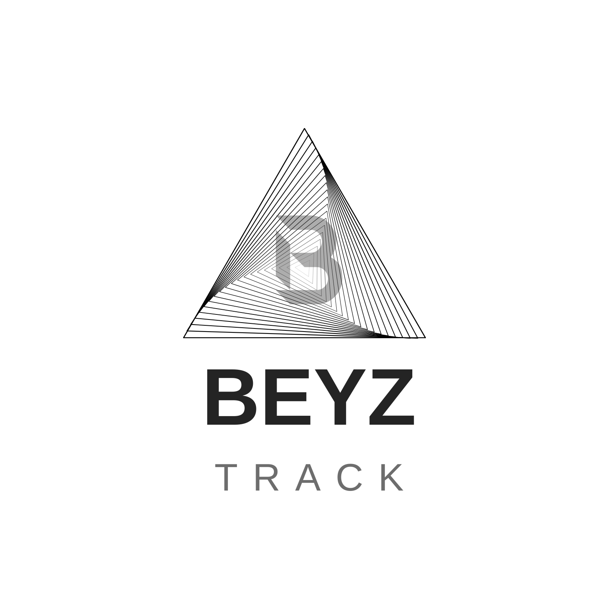

# 🚀 BeyzTrack - Advanced Uptime Monitoring System

<div align="center">
  
  
  **BeyzTrack** - Gerçek zamanlı verilerle çalışan gelişmiş uptime monitoring sistemi
  
  [](https://opensource.org/licenses/MIT)
  [](https://nodejs.org/)
  [](https://vuejs.org/)
</div>

## 📊 Özellikler

### 🔥 **Ana Özellikler**
- **Gerçek Zamanlı Monitoring**: Canlı veri akışı ve anlık durum takibi
- **Gelişmiş Raporlar**: Detaylı analiz ve trend grafikleri
- **Mobil Uyumlu**: Responsive tasarım, tüm cihazlarda mükemmel deneyim
- **Çoklu Monitor Desteği**: HTTP, HTTPS, TCP, UDP, DNS, Ping monitoring
- **Akıllı Uyarılar**: Email, Webhook, Telegram bildirimleri
- **Status Pages**: Müşterileriniz için özel durum sayfaları

### 📈 **Rapor Sistemi**
- **Gerçek Zamanlı Veriler**: Demo değil, canlı sistem verileri
- **Gelişmiş Grafikler**: Chart.js ile interaktif grafikler
- **Trend Analizi**: Performans tahminleri ve anomali tespiti
- **Özel Rapor Oluşturucu**: İhtiyaçlarınıza göre özelleştirilebilir raporlar
- **Çoklu Format**: PDF, HTML, JSON, CSV, XML export
- **Marka Entegrasyonu**: BeyzTrack logosu ve renkleri

### 🎨 **Kullanıcı Arayüzü**
- **Modern Tasarım**: Gradient renkler, gölgeler, yuvarlak köşeler
- **Türkçe Dil Desteği**: Tam Türkçe arayüz
- **Dark/Light Mode**: Tema değiştirme desteği
- **Mobil Optimizasyon**: iPhone, Android uyumlu
- **Hızlı Navigasyon**: Kolay erişim menüleri

## 🚀 Hızlı Kurulum

### **Yöntem 1: 2 Aşamalı Kurulum (Önerilen)**

```bash
# 1. Orijinal Uptime Kuma kurulumu
curl -sSL https://raw.githubusercontent.com/Coosef/beyztrack/main/install-original.sh | bash

# 2. BeyzTrack branding uygulama
curl -sSL https://raw.githubusercontent.com/Coosef/beyztrack/main/brand.sh | bash
```

### **Yöntem 2: Tek Komutla Tam Kurulum**

```bash
# Hem orijinal kurulum hem de branding
curl -sSL https://raw.githubusercontent.com/Coosef/beyztrack/main/install-main.sh | bash
```

### **Yöntem 3: Sadece Branding (Uptime Kuma zaten kurulu)**

```bash
# Sadece BeyzTrack özelliklerini ekle
curl -sSL https://raw.githubusercontent.com/Coosef/beyztrack/main/brand.sh | bash
```

### **Manuel Kurulum**

1. **Gereksinimler**:
   ```bash
   # Node.js 18+ ve NPM
   curl -fsSL https://deb.nodesource.com/setup_18.x | sudo -E bash -
   sudo apt-get install -y nodejs
   
   # PM2 (Process Manager)
   sudo npm install -g pm2
   ```

2. **Proje Kurulumu**:
   ```bash
   git clone https://github.com/kullanici/beyztrack.git
   cd beyztrack
   npm install
   npm run build
   ```

3. **Çalıştırma**:
   ```bash
   # Development
   npm run dev
   
   # Production
   pm2 start server.js --name beyztrack
   ```

## 🐳 Docker Kurulumu

```bash
# Docker Compose ile
docker-compose up -d

# Tek container
docker run -d -p 3001:3001 --name beyztrack beyztrack:latest
```

## 📱 Mobil Uyumluluk

- ✅ **iPhone**: iOS 12+ uyumlu
- ✅ **Android**: Android 8+ uyumlu
- ✅ **Tablet**: iPad, Android tablet desteği
- ✅ **Responsive**: Tüm ekran boyutları

## 🔧 Konfigürasyon

### **Environment Variables**

```bash
# .env dosyası
NODE_ENV=production
PORT=3001
DB_PATH=./data/database.db
UPTIME_ROBOT_API_KEY=your_key_here
```

### **Nginx Reverse Proxy**

```nginx
server {
    listen 80;
    server_name yourdomain.com;
    
    location / {
        proxy_pass http://localhost:3001;
        proxy_http_version 1.1;
        proxy_set_header Upgrade $http_upgrade;
        proxy_set_header Connection 'upgrade';
        proxy_set_header Host $host;
        proxy_cache_bypass $http_upgrade;
    }
}
```

## 📊 API Kullanımı

### **Monitor Ekleme**
```bash
curl -X POST http://localhost:3001/api/monitor \
  -H "Content-Type: application/json" \
  -d '{
    "name": "Google",
    "url": "https://google.com",
    "type": "http",
    "interval": 60
  }'
```

### **Durum Sorgulama**
```bash
curl http://localhost:3001/api/monitor/status
```

## 🛠️ Geliştirme

### **Geliştirme Ortamı**

```bash
# Bağımlılıkları kur
npm install

# Development server
npm run dev

# Build
npm run build

# Test
npm test
```

### **Proje Yapısı**

```
beyztrack/
├── src/
│   ├── components/          # Vue bileşenleri
│   │   ├── reports/        # Rapor modülleri
│   │   └── ...
│   ├── pages/              # Sayfa bileşenleri
│   ├── layouts/            # Layout bileşenleri
│   ├── utils/              # Yardımcı fonksiyonlar
│   └── lang/               # Dil dosyaları
├── public/                 # Statik dosyalar
├── dist/                   # Build çıktısı
└── install.sh             # Kurulum script'i
```

## 🔒 Güvenlik

- **HTTPS**: SSL/TLS desteği
- **Firewall**: Otomatik port konfigürasyonu
- **Authentication**: Kullanıcı kimlik doğrulama
- **Rate Limiting**: API rate limiting
- **Input Validation**: Giriş doğrulama

## 📈 Performans

- **PM2**: Process management
- **Nginx**: Reverse proxy ve caching
- **Database**: SQLite optimizasyonu
- **Memory**: Akıllı bellek yönetimi
- **CDN**: Statik dosya optimizasyonu

## 🤝 Katkıda Bulunma

1. Fork yapın
2. Feature branch oluşturun (`git checkout -b feature/amazing-feature`)
3. Commit yapın (`git commit -m 'Add amazing feature'`)
4. Push yapın (`git push origin feature/amazing-feature`)
5. Pull Request oluşturun

## 📝 Changelog

### **v2.0.0-beta.3**
- ✅ Gerçek zamanlı veri entegrasyonu
- ✅ Gelişmiş rapor sistemi
- ✅ Mobil uyumluluk iyileştirmeleri
- ✅ Backup menü düzenlemesi
- ✅ Logo ve marka entegrasyonu

### **v2.0.0-beta.2**
- ✅ Trend analizi modülü
- ✅ Özel rapor oluşturucu
- ✅ Çoklu format export

### **v2.0.0-beta.1**
- ✅ Vue.js 3 migration
- ✅ Modern UI/UX tasarım
- ✅ Türkçe dil desteği

## 📞 Destek

- **GitHub Issues**: [Issues](https://github.com/kullanici/beyztrack/issues)
- **Email**: support@beyztrack.com
- **Discord**: [Discord Server](https://discord.gg/beyztrack)

## 📄 Lisans

Bu proje MIT lisansı altında lisanslanmıştır. Detaylar için [LICENSE](LICENSE) dosyasına bakın.

## 🙏 Teşekkürler

- [Uptime Kuma](https://github.com/louislam/uptime-kuma) - Orijinal proje
- [Vue.js](https://vuejs.org/) - Frontend framework
- [Chart.js](https://www.chartjs.org/) - Grafik kütüphanesi
- [Bootstrap](https://getbootstrap.com/) - CSS framework

---

<div align="center">
  <strong>BeyzTrack ile sistemlerinizi 7/24 takip edin! 🚀</strong>
</div>